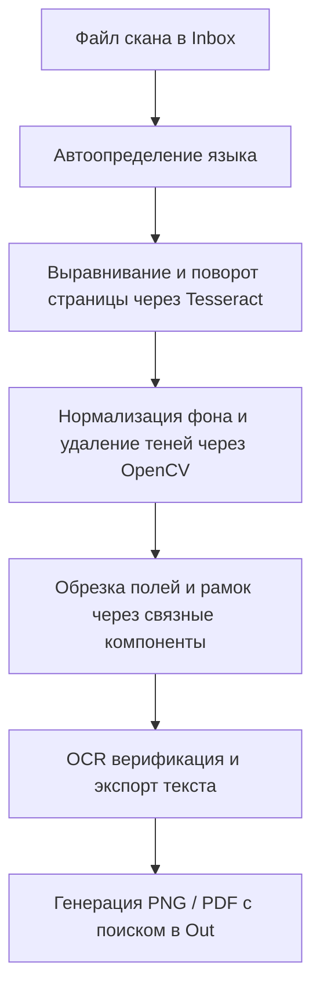

# ✂️ AutoTailor

> **Автоматический интеллектуальный предобработчик сканов документов, выравниватель страниц (de-skewer) и OCR-верификатор.**

[](https://opensource.org/licenses/MIT)
[](https://www.python.org/downloads/)
[](#)
[](https://github.com/tesseract-ocr/tesseract)

AutoTailor автоматически удаляет серый фон сканера (делая бумагу идеально белой), выравнивает перекосы и переворачивает страницы текстом вверх, обрезает лишние поля и рамки, а также распознает текст.

---

### 📊 Сравнение результатов (До / После)

| 📂 Исходный скан (До) | ✨ Очищенный результат (После) |
| :--- | :--- |
| **Проблемы:** Серый фон, тени, перекос страницы, черные поля сканера. | **Результат:** Обрезка полей, выравнивание текста, чисто белый фон. |
| <pre align="left">┌──────────────────────────────────────┐<br>│░░░░░░░░░░░░░░░░░░░░░░░░░░░░░░░░░░░░░░│<br>│░░   /   \                             ░░│<br>│░░  /  _  \  _ __  _ __   __ _  _ __   ░░│<br>│░░ /  /_\  \| '__|| '_ \ / _` || '_ \  ░░│<br>│░░/  ┌───┐  \  |  | |_) | (_| || | | | ░░│<br>│░░\_/     \_/__|  | .__/ \__,_||_| |_| ░░│<br>│░░                |_|                  ░░│<br>│░░░░░░░░░░░░░░░░░░░░░░░░░░░░░░░░░░░░░░│<br>│░░░░░░ [ Перекос / Серый фон / Тени ] ░░│<br>│░░░░░░░░░░░░░░░░░░░░░░░░░░░░░░░░░░░░░░│<br>└──────────────────────────────────────┘</pre> | <pre align="left">┌──────────────────────────────────┐<br>│   /   \                          │<br>│  /  _  \  _ __  _ __   __ _      │<br>│ /  /_\  \| '__|| '_ \ / _` |     │<br>│/  ┌───┐  \  |  | |_) | (_| |     │<br>│\_/     \_/__|  | .__/ \__,_|     │<br>│                |_|               │<br>└──────────────────────────────────┘<br><br><b>[Распознанный текст OCR]</b><br>✓ Язык: RU<br>✓ Контрольные слова: ПЛАН, СХЕМА</pre> |
| **Фон:** `#D2D2D2` (темно-серый)<br>**Поворот:** `-12.5°` (кривой скан)<br>**Поля:** Черные рамки от сканера | **Фон:** `#FFFFFF` (идеально белый)<br>**Поворот:** `0.0°` (выровнен)<br>**Поля:** Обрезано по контурной рамке |

---

### 🚀 Умная автонастройка (Zero-Setup)

В AutoTailor встроен интеллектуальный режим автоопределения. При обработке папки с файлами программа автоматически сканирует первый лист, распознает язык документов (русский, украинский или английский) и загружает подходящие словари поиска, правила переворота страниц и язык отчетов.

> [!NOTE]
> **Не требуется ручная конфигурация** — программа динамически подгрузит нужный профиль (`configs/config.<язык>.json`) автоматически.

---

## ⚡ Быстрый старт (Для пользователей Windows)

Вам не нужно уметь программировать или настраивать окружение. Настройка AutoTailor полностью автоматизирована.

### 1️⃣ Первоначальная настройка (Один раз)
1. Дважды кликните по файлу **`setup_windows.bat`** в папке программы.
2. Скрипт автоматически установит **Python**, систему распознавания **Tesseract-OCR** и все необходимые библиотеки.
3. Дождитесь окончания процесса. Если Windows Defender или контроль учетных записей (UAC) запросят разрешение, подтвердите его.

> [!IMPORTANT]
> Скрипт первоначальной настройки требует права администратора для автоматической установки Tesseract OCR и прописывания его в глобальные переменные окружения PATH.

### 2️⃣ Обработка документов
1. Скопируйте файлы сканов (`.jpg`, `.png`, `.bmp`) в папку **`inbox`**.
2. Дважды кликните по файлу **`Process_Inbox.bat`**.
3. Откройте папку **`out`** — там будут лежать очищенные PNG файлы, объединенные PDF-документы и текстовые отчеты с распознанным текстом.

### 3️⃣ Режимы очистки фона
Вы можете изменить алгоритм очистки, запустив один из вспомогательных файлов:
* **`Set_Mode_Gray.bat`** (По умолчанию): Очищает серый налет, но сохраняет цветные печати, подписи и синие чернила.
* **`Set_Mode_BW.bat`**: Переводит скан в черно-белый формат с высоким контрастом (идеально для текста и OCR).
* **`Set_Mode_Color.bat`**: Очищает тени, полностью сохраняя исходные цвета документа.

---

## ⚙️ Принцип работы (Конвейер)



---

## 🔧 Настройка параметров (`config.json`)

Вы можете открыть `config.json` в любом текстовом редакторе для тонкой настройки.

```json
{
  "mode": "gray",
  "ocr_language": "rus+eng",
  "ocr_checklist": ["СХЕМАТИЧЕСКИЙ", "ПЛАН", "ЭКСПЛИКАЦИЯ"],
  "rotation_keywords": ["план", "этаж", "область", "улица", "здание", "схема"],
  "report_language": "ru",
  "tessdata_dir": null
}
```

### Описание параметров

| Параметр | Тип | По умолчанию | Описание |
| :--- | :--- | :--- | :--- |
| `mode` | `string` | `"gray"` | Режим очистки фона (`gray`, `bw`, `color`). |
| `ocr_language` | `string` | `"rus+eng"` | Языковой пакет Tesseract OCR (например, `rus`, `eng`, `ukr`). |
| `ocr_checklist` | `list` | `[...]` | Ключевые слова для проверки типа документа и его валидации. |
| `rotation_keywords` | `list` | `[...]` | Ключевые слова для ориентации (поворачивает лист до горизонтального чтения слов). |
| `report_language` | `string` | `"ru"` | Язык логов консоли и текстовых отчетов (`ru` или `en`). |
| `tessdata_dir` | `string` | `null` | Пользовательский путь к языковым файлам Tesseract при необходимости. |

---

## 💻 Установка для разработчиков (Advanced)

Если вы разработчик, вы можете установить библиотеку локально через `pip` и запускать её напрямую в консоли:

```bash
# Клонирование и локальная установка
git clone https://github.com/MakDvornikoff/AutoTailor.git
cd AutoTailor
pip install .
```

### Использование через CLI

```bash
# Обработать один файл
autotailor путь/к/файлу.jpg путь/к/выходной_папке/

# Обработать все файлы в папке inbox
autotailor --inbox
```

---

## 📄 Лицензия

Этот проект распространяется под свободной лицензией **MIT**. Подробнее см. файл [LICENSE](LICENSE).
